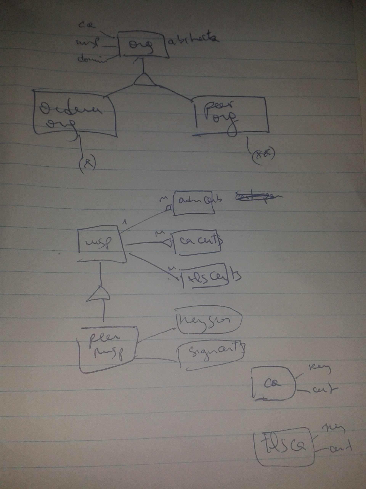
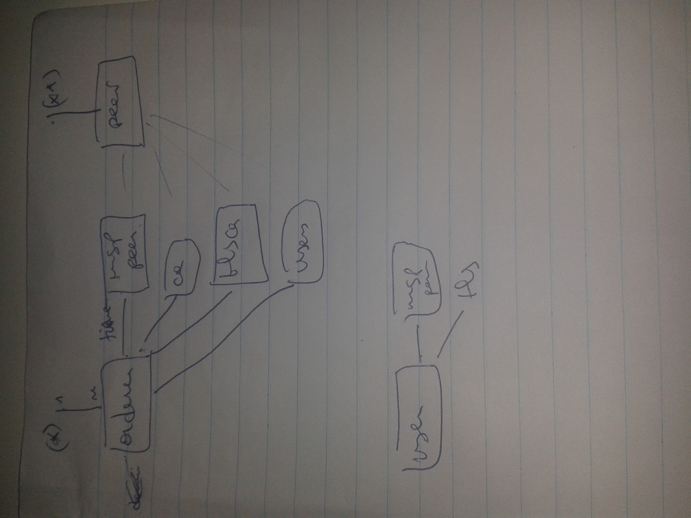
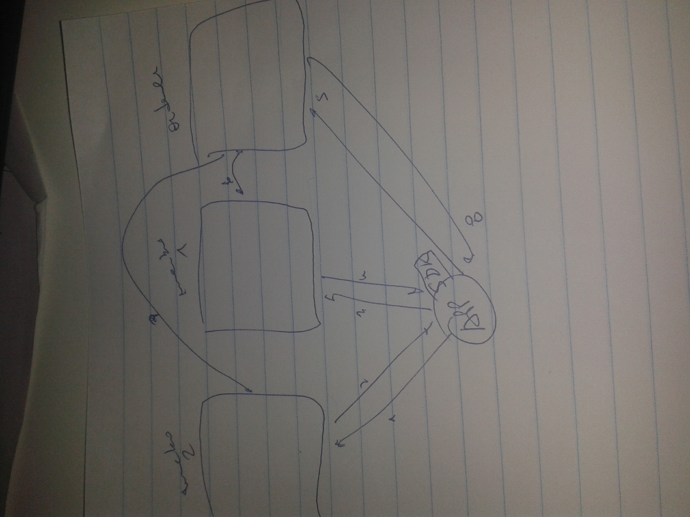
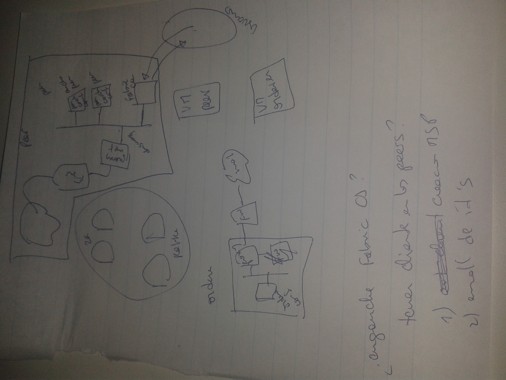

# Topologia

## Diseño

La unidad de las redes de negocio de Fabric son las organizaciones. Las hay de dos tipos: orderer y peer. Los peers pueden estar en un consorcio, esto es, compartir un canal.

Las organizaciones tiene MSP, que son conjuntos de certificados y claves que permiten conectarse unos con otros y acceder a funcionalidades de distintos servicios.

La información criptográfica de los componentes se puede obtener de Fabric CA.

Las herramientas para deployar Fabric que da IBM están pensadas como 'atajos'. Si bien es posible usarlas en producción, no parece lo más recomendable.

Por un lado, distinguimos como serían los componentes de un peer con HA en una organizacion. Por otro, los componentes del orderer. Finalmente, vemos como una aplicación interactuaría con la red.

## Estructura alto nivel

Recordamos que una aplicación que vaya a interactuar con el chaincode debe, primero, tener credenciales (primer interacción con Fabric CA).

Luego, enviará la transacción a un conjunto de peers, los endorsers, que la firmarán. Con estas firmas, la aplicación (con el SDK), envía la transacción a los orderers, que la ensamblan en un bloque y la distribuyen entre los demás nodos que estén en la red y en el canal.

A continuacion vamos a ver qué habría dentro de un 'peer' y dentro de un 'orderer'

## Una organizacion (tipo peer) en una red privada

Compuesta de:

- 1 o más peers (uno es ancho peer)
- Fabric CA (en HA)
- Por razones de seguridad, consideramos que conviene que esté en una red privada, en VMs con reglas de firewall locales, protegidas detrás de un proxy y un firewall corporativo.

Un peer basicamente es un binario + un conjunto de variables de entorno + material criptográfico (obtenido de interactuar con Fabric CA, openssl, u otro mecanismo). 

La manera más sencilla y segura es usar templates de VMs. Los procesos configurarlos con supervisord (chequea que estén arriba, centralizo las variables de ambiente del proceso, etc.)

CouchDB estaría en la misma VM que el proceso peer.

## Una organizacion (tipo orderer) en una red privada

Compuesta de:

- Orderer (solo o cluster de zookeeper y kafka)
- Por razones de seguridad,  consideramos que conviene que esté en una red privada, en VMs con reglas de firewall locales, protegidas detrás de un proxy y un firewall corporativo.

Un orderer solo está en la misma situación que el caso anterior.

Un orderer con HA y mejor performance requiere cluster de kafka y zookeeper. Esto agrega:
  - 3 zookeepers
  - Determinado por el throughput requerido

 ALERTA!
   El cluster de Kafka es un punto centralizado de la red. Basicamente es el consenso. Las transacciones van ahí. Hay que ver si están encriptadas o se pueden alterar. Es el componente central a la seguridad de toda la red.

